AIMS APP TUTORIAL
=================
This tutorial will run through AIMS's User-Guide.  
The tutorial covers from an installation of AIMS to the various ways of using AIMS program.    
  
1.Installation 
--------------------------
- On AIMS website, you can download AIMS program for your Operating System (Windows OS and Mac OS support).  
  - Download: [AIMS.APCC21.ORG](http://aims.apcc21.org)   

- Setup process and User-interface are same on both Windows OS and Mac OS.  
- After the installation is finished, AIMS will auto-run and AIMS desktop icon will be created.  
  
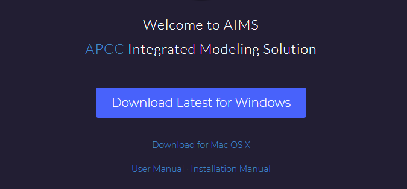     
2.First Screen
----------------------
  
**First screen**  
- You can create a new project by clicking **'+New Project'** Icon.
- On the right side, there is a **News Feed**, which contents are related to AIMS.
- If you want to change AIMS program settings, '⚙' icon is located on right corner of the screen.  

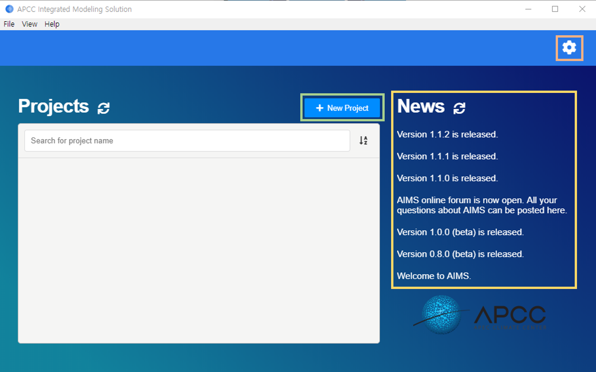  
  
  
**Application Preference screen**  
- By clicking '⚙' icon, you can change **Workspace Directory** and **Database Directory**.  
  - *Workapce Directory* = Directory for saving project
  - *Database Directory* = Directory for saving shared data for project  
 
- You can simply log off by clicking **'Log Off'** button.  
   
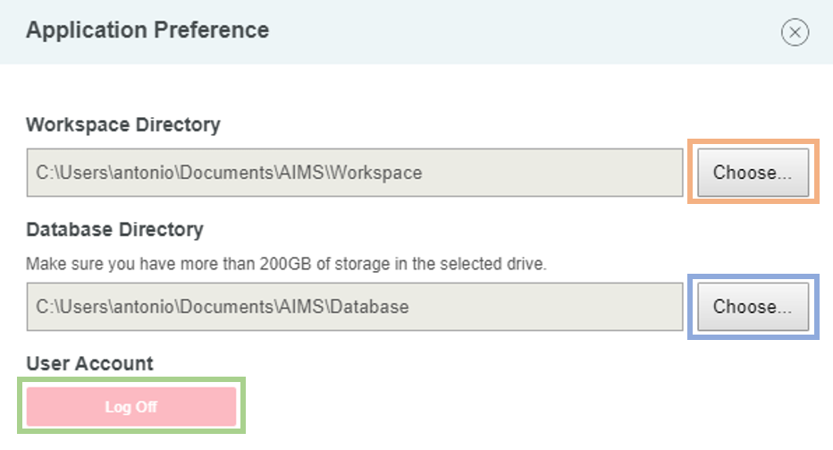  
  
  
3.Create a new project
---------------- 
**Create a new project screen**  
- In order to create a new project, you need to select a project type and enter a project name.  
  
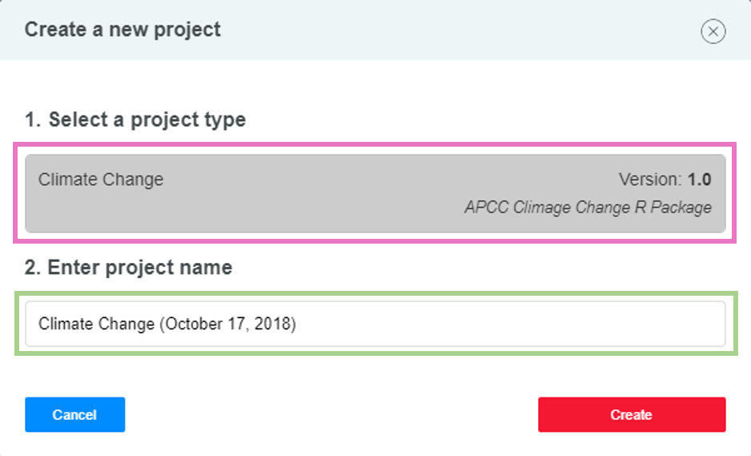

**Project Selection Screen**  
- Select a project you wish to run. 
  
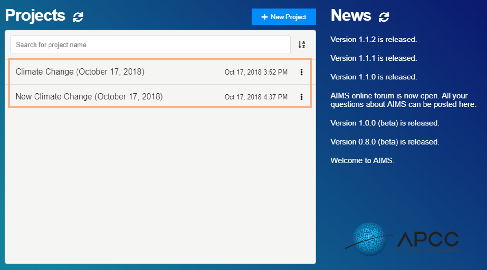  
  
**Project Screen(1-a)**  
The screen represents the view of your selected project screen  
  
- **'🏠'** icon is located on the left corner, by clicking it you can retrieve to the *first page*.  
- **'▶'** icon and **↻** icon are located on top of the middle.  
  - **'▶'** icon: Run a project  
  - **'↻'** icon: Restart a project  
- On right side of the screen, you can find out project name and description.  

  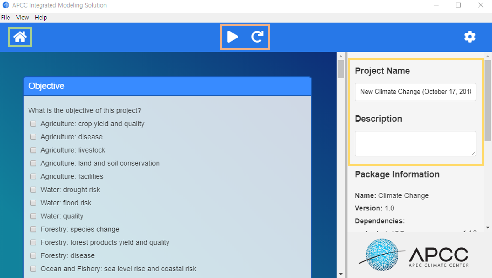  
    	
**Project Screen(1-b)**  
The screen represents the view of *Project Screen(1-a)*, and right side tab is scrolled down.  
  
- On right side of the screen, you can find out package information.  
  - Package information contains name, version, and dependencies.  
  
- *Export and Upload Buttons*  
  - By clicking **'Export'** button, you can save a current project result as (000.aims.proj) format.  
  - By clicking **'Upload to Aims-web'** button, you can upload a current project result to Aims-web.  

- *Reset Buttons*  
  - By clicking **'Reset Workflow Status'** button, you can refresh all workflow status.  
  - By clikcing **'Reset All Settings'** button, you can reset all settings.  
  
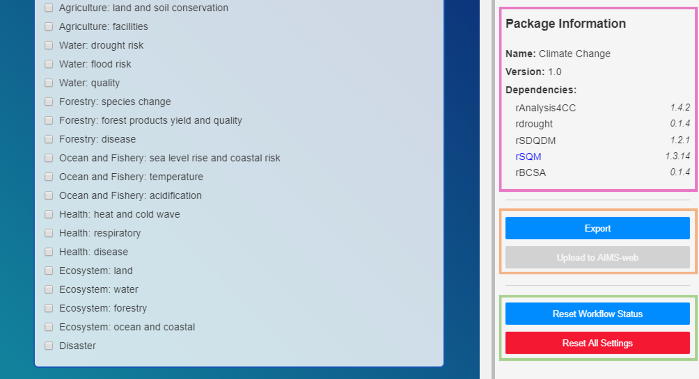  
  
  
4.Project Card Settings  
------------------
Each card in project contains unique task(Operation Algorithm), and it starts from top to bottom during execution.  
  
  
**Obejective Selection Setting**  
- Select one or multiple objectives  
  
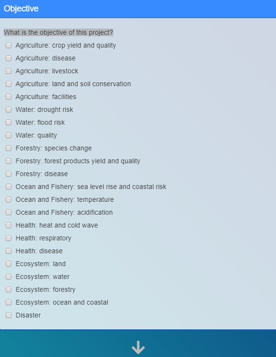  
  
**Data Source Setting**  
- Select one or more data sources  
- Select a region  
  
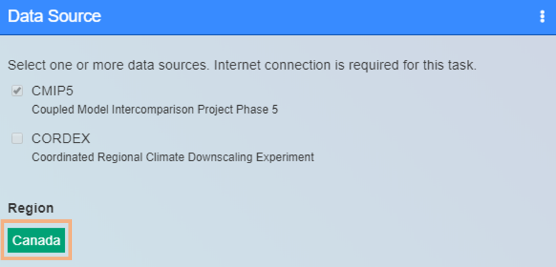  
  
**Local Data Setting**  
- Preparing custom local data files
  - Save and change station data template (.csv)file  
  - Save and change observation data template (.csv)fiie  
- Import template files
  - Click **Import Template files** button, when you ready for station data and observation data file.  
  
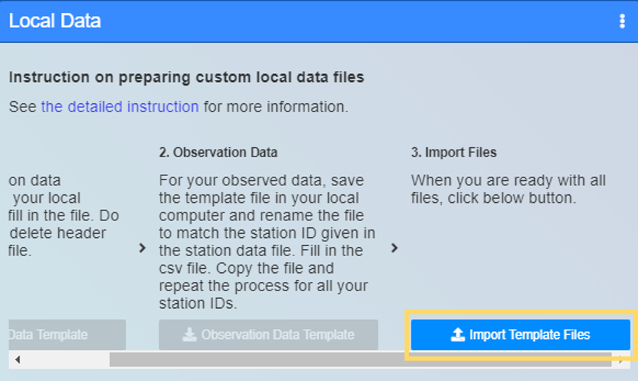  
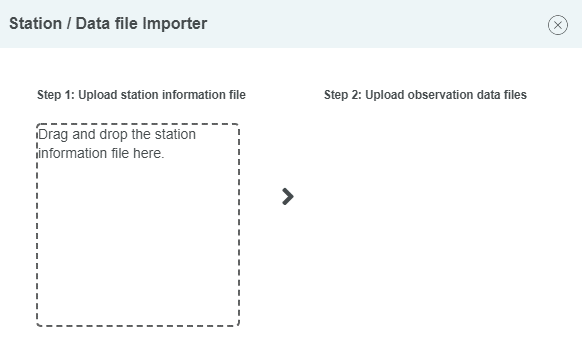  
  
**Evaluate Obeserved Data Setting**  
- Select one or more variables  
- Enter start year and end year for observed type
  
  
  
**Process Stopper Setting**  
- **Unclicked**: Program will be stop at the point where the process stopper is unclicked.  
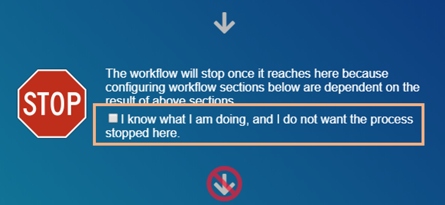  
  
- **Clicked**: Program will be executed without interference.  
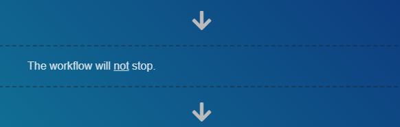  
  
**Downscale Setting**  
- Select GCM names  
- Select Scenario  
- Select one or more variables  
- Enter start year and end year for each type [Observed, Historical(GCM), Future(GCM)]
- Select one or multiple downscale methods  
  
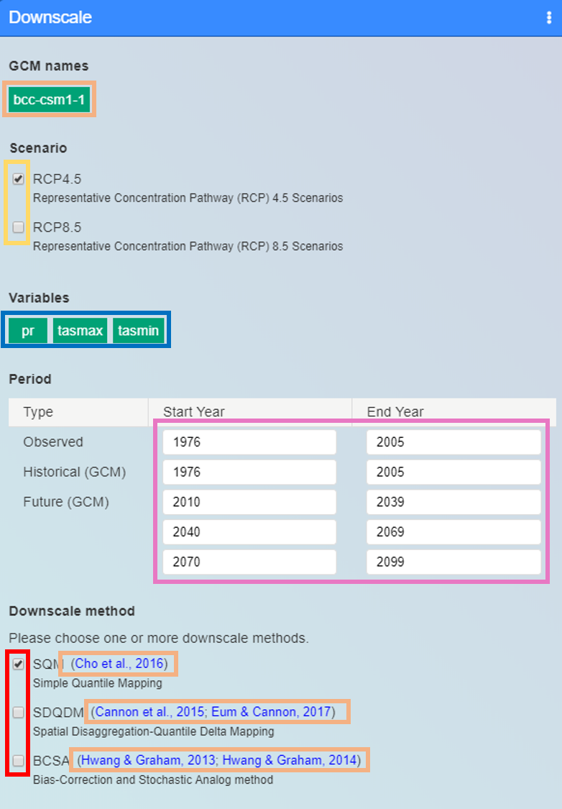  
  
**Climate-change-index-calculation**  
- Select one or multiple GCM names  
- Add a custom index by your needs  
  
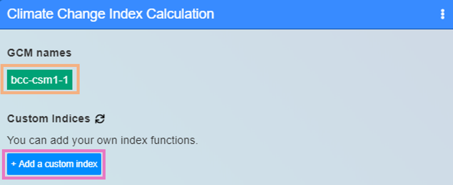
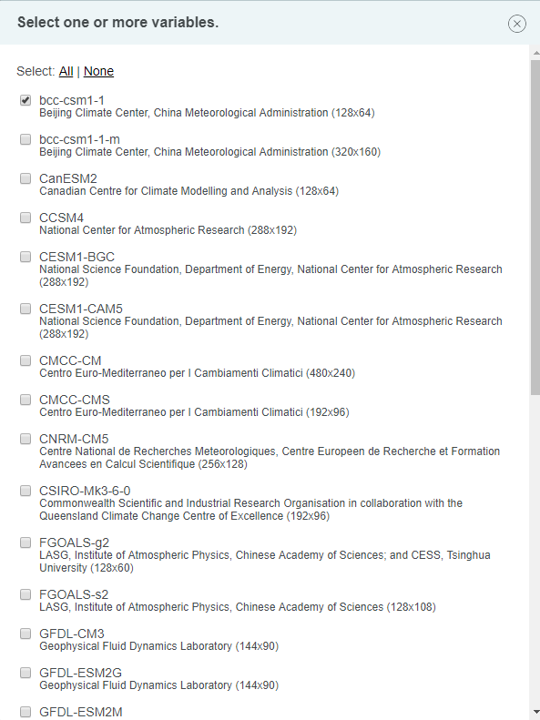  
  
**Weight-factor-and-uncertainly-for-GCMs**  
- Select one of multiple indices  
- Choose one downscale method  
  
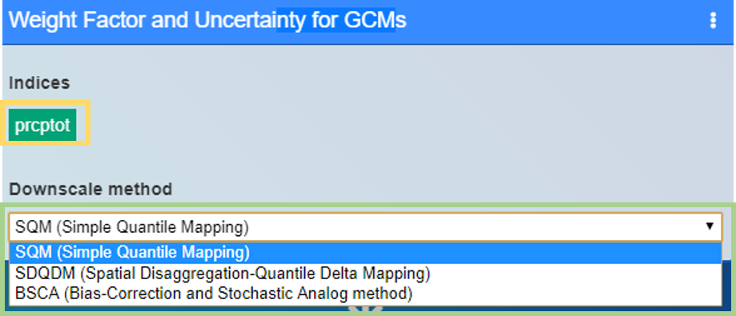
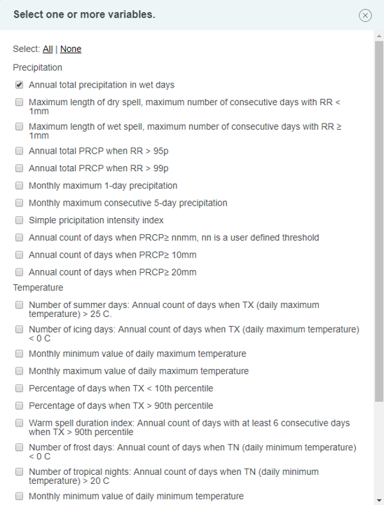  
  
**Modeling-drought-index**  
- Select one or multiple GCM names, by clicking **'ADD'** button  
- Enter start year and end year for calibration type  
  
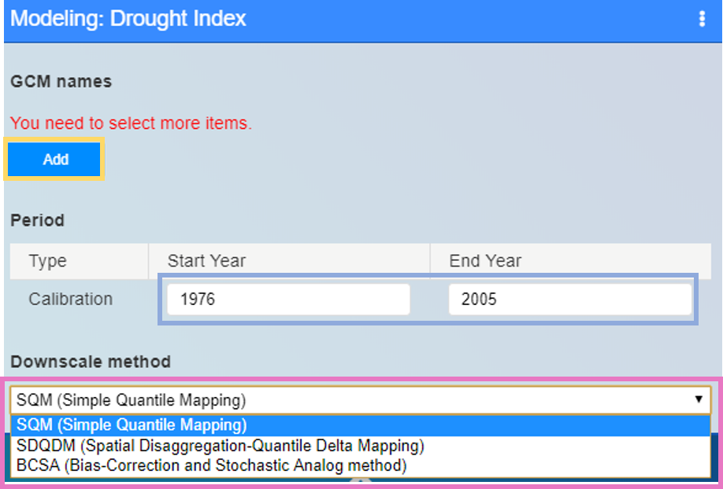
  
  
**References**
- This card contains all references that has been used in a current project  
  
  
  
  
5.Project Execution
---------------------
- After finishing project card settings, you can execute the project.  
- First execution can possibly be slow, due to sub-package dependences have not been installed yet.  
- If you execute a project, all other buttons will be inactivated except **'Play and Stop'** Button.  
  
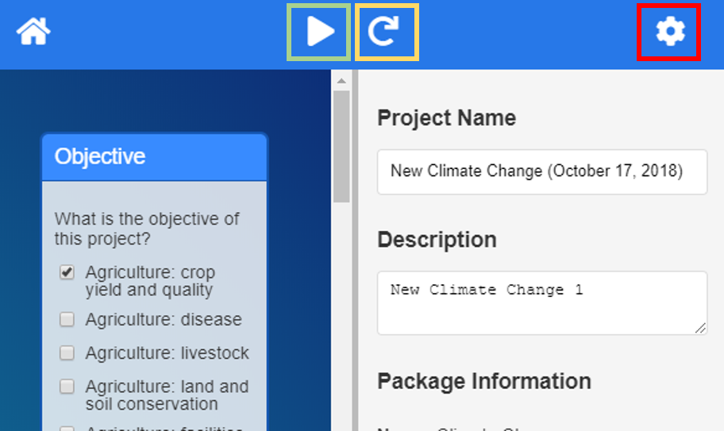  
  
**Notification during Execution**  
- **'Running'** status expresses that the current card is running  
  
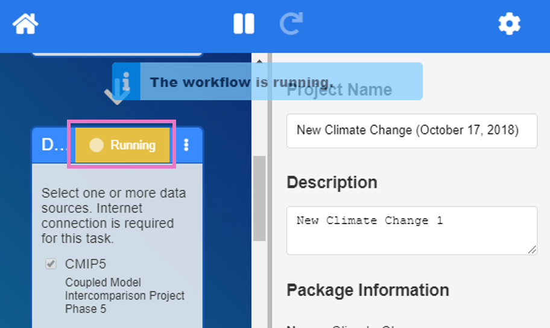  
  
- **'error'** status expresses that the current card has been errored
  - If the error occurs, you can open log file by clikcing **'⋮'** button.  
  
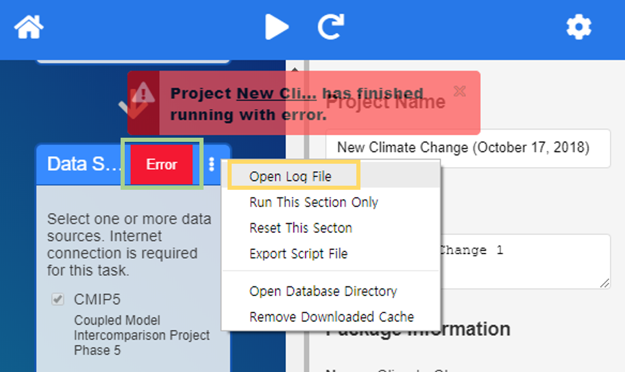  

- If you wish to execute single card, you can click **'run-this-section-only'**.  
  
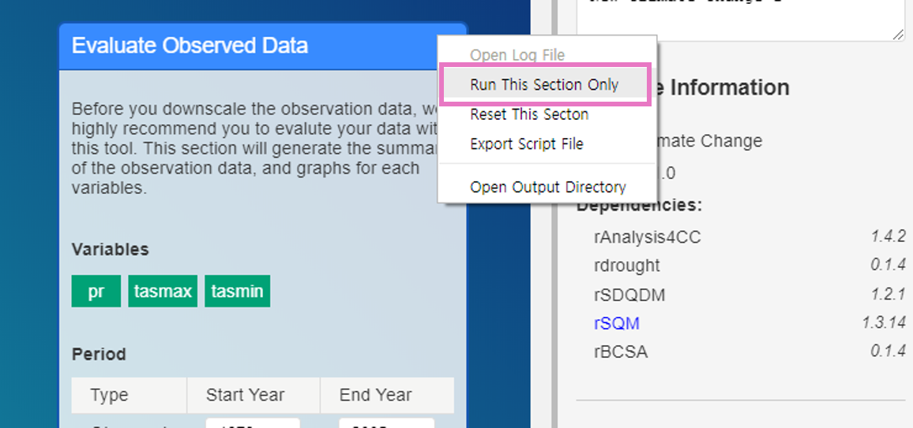  
